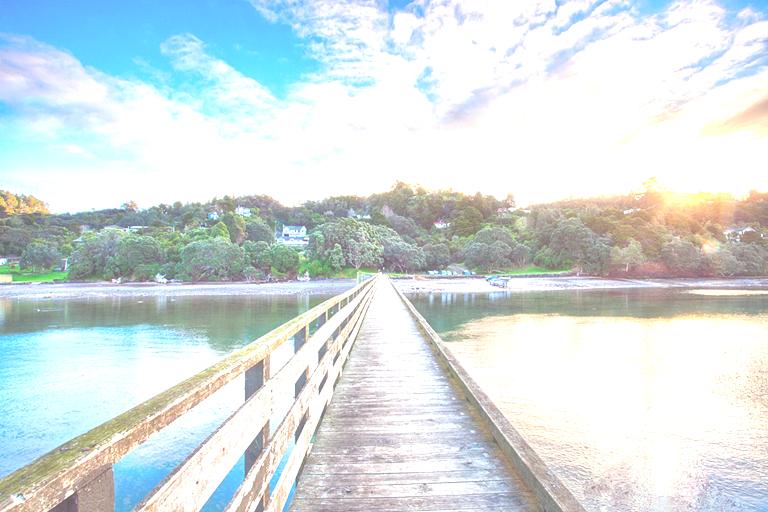
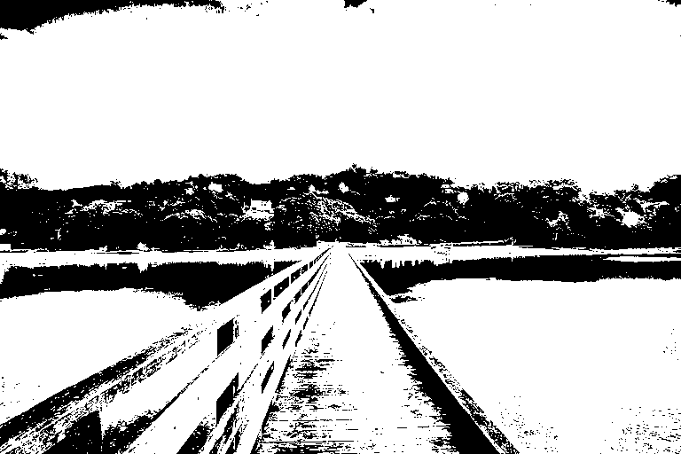

# Image Processing Project

## Simulation Result

## 📥 Input Image

## 📤 Output Images

### Brightness Adjustment

`SIGN = 1`  
`VALUE = 100`  

### Image Inversion

### Thresholding

`THRESHOLD = 100`  

